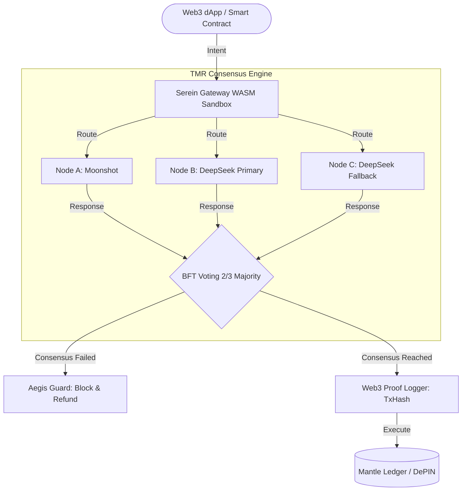

# Serein: Decentralized Trustless AI Gateway

[](https://www.rust-lang.org/)
[](https://wasi.dev/)
[](./LICENSE)

---

## The Web3 Problem

Smart contracts and DePIN (Decentralized Physical Infrastructure) networks demand deterministic, verifiable outputs. Yet the dominant AI paradigm — querying a single centralized LLM — introduces two fatal flaws:

1. **Hallucination Risk:** A single model can produce non-deterministic, fabricated, or poisoned responses. On-chain logic that consumes unverified AI output is vulnerable to catastrophic cascading failures.
2. **Single Point of Failure:** Centralized API providers (OpenAI, Anthropic, etc.) become trust anchors. If the provider is compromised, rate-limited, or censored, the entire dApp halts.

**Serein** solves this by acting as a trustless middleware layer between Web3 applications and AI providers — ensuring every LLM response is consensus-verified, cryptographically provable, and sandbox-isolated before it ever touches a smart contract.

---

## The Serein Architecture



---

### TMR (Triple Modular Redundancy) Engine

Inspired by aerospace-grade fault-tolerant computing, Serein's TMR Engine queries **three independent LLM providers simultaneously** for every request. A deterministic consensus algorithm compares responses, requiring at least 2-of-3 agreement before forwarding the result. This eliminates single-model hallucination and ensures Byzantine fault tolerance at the AI layer.

### Wasmtime Memory Sandbox

Every tenant (dApp, DePIN node, or smart contract) executes inside a strictly isolated **Wasmtime** runtime with WASI 0.3 Component Model compliance. The sandbox enforces:

- **Fuel-based compute limits** — no unbounded execution
- **Epoch interruption** — time-bound request lifecycle
- **Guest trap isolation** — a panicking tenant cannot crash the host
- **Capability-based security** — tenants receive only explicitly granted permissions

### Verifiable AI Proofs

Every consensus result is hashed (BLAKE3) and logged with a cryptographic proof containing:

- The original request fingerprint
- Provider identities and individual responses
- Consensus outcome and confidence score
- Timestamp and session nonce

These proofs can be submitted on-chain via the `[WEB3_PROOF]` log stream, enabling smart contracts to verify that AI inputs passed through Serein's TMR pipeline without trusting any single provider.

---

## Quick Start (1-Click Deploy)

```bash
$ docker-compose up --build
```

### Expected Terminal Output

```
serein-gateway  | [2026-05-14T10:00:00Z INFO  serein_core] Loading WASI 0.3 component model runtime...
serein-gateway  | [2026-05-14T10:00:01Z INFO  serein_core] Wasmtime engine initialized | fuel_limit=1000000 epoch_interval=1s
serein-gateway  | [2026-05-14T10:00:01Z INFO  serein_server] Gateway listening on 0.0.0.0:8080
serein-gateway  | [2026-05-14T10:00:01Z INFO  serein_server] Metrics endpoint: 0.0.0.0:9090
serein-gateway  | [2026-05-14T10:00:05Z INFO  serein_core::tmr] TMR Engine online | providers=3 consensus_threshold=2
serein-gateway  | [2026-05-14T10:00:05Z INFO  serein_core::proof] [WEB3_PROOF] proof_id=0x7f3a...b2e1 hash=blake3:9c8d... status=ready
serein-gateway  | [2026-05-14T10:00:05Z INFO  serein_core::billing] [DEPIN_BILLING] cycle_started | budget_usd=100.00 degradation_threshold=0.05
```

---

## Repository Structure

```
serein/
├── apps/
│   └── gateway/              # Production API gateway (Axum + Tower)
│       └── src/
│           ├── bin/
│           │   └── scheduler.rs
│           └── main.rs
├── crates/
│   ├── core/                 # Kernel: Wasmtime host, TCB, security primitives
│   │   └── src/
│   │       ├── engine/       #   wasmtime_rt, fuel_monitor, hot_swap
│   │       └── security/     #   capabilities, hmac_auth, log_sanitizer, tpm_measure
│   ├── llm-router/           # TMR consensus, provider fan-out, proof logging
│   │   └── src/
│   │       ├── web3/         #   crypto_billing, proof_logger
│   │       └── coordinator.rs
│   ├── consensus/            # Byzantine-tolerant consensus algorithms
│   ├── sandbox-guard/        # WASI virtualization & deterministic hooks
│   ├── cache-storage/        # TMR result cache with staleness detection
│   ├── traffic-control/      # Rate limiting & circuit breaker
│   ├── telemetry/            # OpenTelemetry observability
│   ├── worker/               # Background task execution
│   └── interfaces/           # WASI 0.3 .wit contracts
├── plugins/
│   └── openai-compatible/    # OpenAI-compatible API surface
├── config/
│   ├── providers.toml        # LLM provider registry
│   └── waf_signatures.json   # Web Application Firewall rules
├── scripts/
│   └── provision-gateway.ps1 # Gateway provisioning script
├── docker-compose.yml
├── Dockerfile
└── Cargo.toml
```

---

## License

Copyright (c) 2026 Changqing Zhang. Licensed under AGPL-3.0-or-later.

See [LICENSE](./LICENSE) for the full text.